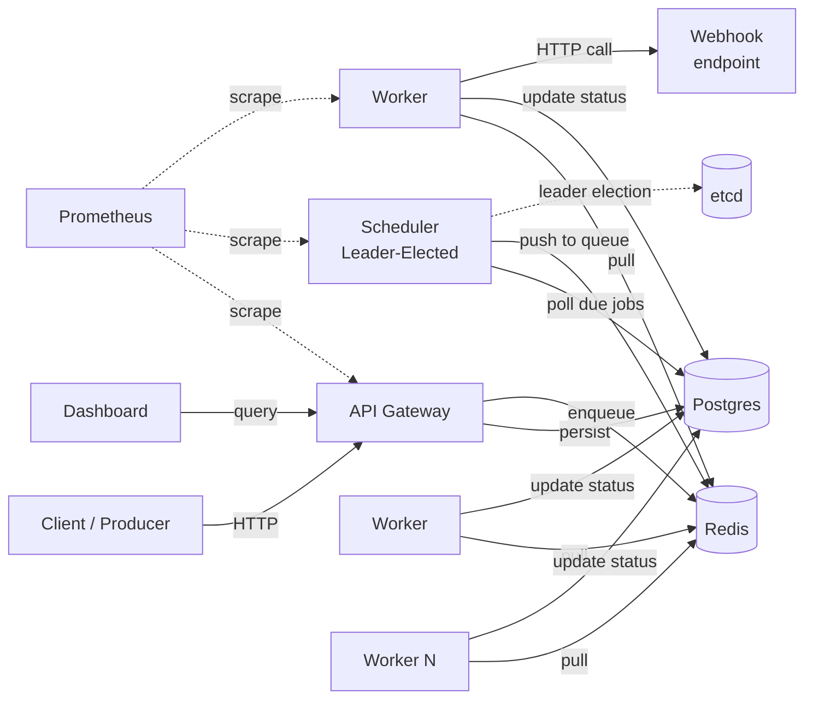

# Sluice

> A horizontally scalable, durable job scheduler written in Go. At-least-once delivery, exponential backoff, leader-elected HA, and a real dashboard.

[](https://golang.org)
[](LICENSE)
[](https://github.com/JoshBlazer/Sluice/actions/workflows/ci.yml)

Sluice is a from-scratch alternative to Sidekiq, Celery, or AWS SQS + EventBridge for teams that want the durability of a relational store, the throughput of an in-memory queue, and the operational simplicity of a single Go binary per role.

---

## Why Sluice?

Most teams reach for either a Redis-only queue (fast but loses jobs on crash) or a full workflow engine like Temporal (powerful but heavy). Sluice occupies the middle: Postgres as the durable source of truth, Redis as the hot path, and a clean separation between scheduling and execution.

- **Redis is just a cache.** The API answers only after the job is committed to Postgres. Flush or lose Redis entirely and the scheduler rebuilds the queues from Postgres; in the chaos tests, 3,000 in-flight jobs all ran within about 40 seconds of Redis losing its data
- **Durable by default.** Jobs survive crashes, network partitions and worker death. A crashed worker's job is picked up again within 20 seconds
- **At-least-once delivery, without double-writes.** A stalled worker that wakes up after its job was reassigned can't overwrite the new result, and idempotency keys deduplicate submissions
- **Scheduler HA.** Leader election via etcd with hot standbys. Failover takes ~50 ms on shutdown and 1.5–2.6 s after a crash, and two leaders overlapping briefly can't double-run anything
- **Multi-tenant and secure.** Per-tenant rate limits and concurrency caps, weighted fair queuing, isolated data, hashed API keys, signed webhooks ([Standard Webhooks](https://www.standardwebhooks.com/)), and webhooks that refuse to call internal addresses
- **High throughput.** Designed for 10k+ jobs/sec; workers run many jobs concurrently
- **Observable.** Prometheus metrics with alert rules and a Grafana dashboard, OpenTelemetry traces that follow a job from its submission to its execution, structured logs
- **Operable.** Graceful shutdown that finishes in-flight jobs, automatic retention, an admin CLI and admin API, a Helm chart that migrates the database itself

The durability, failover, isolation and security behaviour above is covered by tests that CI runs on every push, with the race detector on, against real Postgres, Redis and etcd, plus weekly [chaos tests](docs/testing.md#failure-mode-chaos-tests). Throughput is a design target; see [Performance](#performance).

---

## Quick Start

Needs Go 1.26+, Docker, and the `migrate` CLI (`make bootstrap` installs it).

```bash
git clone https://github.com/JoshBlazer/Sluice && cd Sluice
make bootstrap        # installs migrate, downloads Go modules

# Start Postgres, Redis, etcd, Jaeger and Prometheus, then create the schema
make up
make migrate-up

# Run each role (separate terminals). The worker flag lets webhooks reach
# localhost; production workers refuse private addresses.
make dev-api
make dev-scheduler
SLUICE_WEBHOOK_ALLOW_PRIVATE=true make dev-worker

# Enable the local-only "dev" tenant (API key: dev-token). Migrations disable it
# on every database, so it never works anywhere you haven't run this.
go run ./cmd/sluice-cli enable-dev-tenant

# Submit a job: a webhook to httpbin, which echoes the request back
curl -X POST http://localhost:8080/v1/jobs \
  -H "Authorization: Bearer dev-token" \
  -H "Content-Type: application/json" \
  -d '{
    "type": "webhook",
    "payload": {"url": "https://httpbin.org/post", "method": "POST", "body": {"order": 1234}},
    "max_retries": 5,
    "idempotency_key": "order-1234"
  }'

# Check on it (use the id from the response): status, then every attempt
curl -H "Authorization: Bearer dev-token" http://localhost:8080/v1/jobs/<id>
curl -H "Authorization: Bearer dev-token" http://localhost:8080/v1/jobs/<id>/runs

# Register a recurring job
curl -X POST http://localhost:8080/v1/schedules \
  -H "Authorization: Bearer dev-token" \
  -H "Content-Type: application/json" \
  -d '{
    "name": "nightly-cleanup",
    "cron": "0 2 * * *",
    "timezone": "Europe/London",
    "job_template": {"type": "webhook", "payload": {"url": "https://httpbin.org/post", "method": "POST"}}
  }'

# Dashboard (Node 24): sign in with dev-token at http://localhost:3000
cd web && npm install && npm run dev -- --port 3000
```

Traces for these requests are in Jaeger at http://localhost:16686, and metrics in Prometheus at http://localhost:9090.

---

## Documentation

| | |
|---|---|
| [Jobs and webhooks](docs/jobs-and-webhooks.md) | Job fields, priorities, retries, schedules, delivery guarantees, verifying signatures, security |
| [Configuration](docs/configuration.md) | Every flag and environment variable, database pool sizing, retention |
| [Deployment](docs/deployment.md) | Releases, the Docker image, the Helm chart, recommended production layout |
| [Operations](docs/operations.md) | Tenants, the admin CLI and admin API, observability, the dashboard |
| [Testing](docs/testing.md) | Unit, integration and chaos tests, load testing |
| [Architecture](architecture.md) | Design and trade-offs |
| [API reference](internal/api/openapi.yaml) | OpenAPI 3.1, also served by the API at `/openapi.yaml` |

---

## Architecture at a Glance



- **API** validates and authenticates submissions, commits them to Postgres, then pushes them onto Redis.
- **Workers** pop from Redis, claim the job in Postgres (`SELECT … FOR UPDATE SKIP LOCKED`, respecting tenant concurrency caps), run the webhook with heartbeats, and record the outcome.
- **Scheduler** (one leader, hot standbys) enqueues due and retrying jobs, fires cron schedules, recovers crashed workers' jobs, rebuilds Redis from Postgres, and prunes old data.

---

## Performance

Design targets are for a 3-node cluster (4 vCPU / 8 GB RAM each), Postgres 16, Redis 7. Measurements come from the [Benchmark workflow](.github/workflows/benchmark.yml), which runs Postgres, Redis, etcd and every Sluice role together on **one** 4-vCPU GitHub-hosted runner (a quarter of the target hardware), plus failover and recovery checks in CI:

| Metric | Target (3 nodes) | Measured (1 shared 4-vCPU runner) |
|--------|--------|----------|
| Submission throughput | 10,000+ jobs/sec | 1,550–3,500 jobs/sec; not yet run on target hardware |
| Execution throughput | — | 1,200–2,500 jobs/sec (20,000 jobs, 0 duplicate executions) |
| Latency p50 (submit → execute) | < 10 ms | 0.6–1.0 ms |
| Latency p99 (submit → execute) | < 50 ms | 2.8–8 ms (one noisy run: 65 ms) |
| Scheduler failover | < 2 seconds | ~50 ms on shutdown; 1.5–2.6 s after a crash, bounded by etcd lease expiry (checked in CI) |
| Worker crash recovery | — | < 20 seconds (checked in CI) |
| Recovery from full node loss | < 30 seconds | ~12 s: every Sluice process killed with 3,000 jobs in flight, none lost ([chaos tests](docs/testing.md#failure-mode-chaos-tests)) |

Throughput is given as a range because GitHub assigns runners with different CPU models, and the same code measures up to 2x apart between them. To reproduce these numbers against your own stack, see [Load testing](docs/testing.md#load-testing).

---

## Tech Stack

- **Go** 1.26+ (built with the 1.27 toolchain): `chi`, `pgx/v5`, `go-redis/v9`, etcd client v3, `log/slog`
- **Storage and coordination:** PostgreSQL 16 (source of truth), Redis 7 (hot queue), etcd v3 (leader election)
- **Observability:** Prometheus, OpenTelemetry (OTLP, Jaeger locally), Grafana
- **Dashboard:** Next.js 16, React 19, TypeScript, TanStack Query, Tailwind CSS 4 + shadcn/ui, Recharts, live updates over WebSocket
- **Deployment:** multi-arch Docker images on GHCR, Helm chart, plain Kubernetes manifests, Docker Compose for local development
- **CI:** GitHub Actions (tests with `-race`, kind smoke test, chaos and benchmark workflows, `govulncheck`, `npm audit`), Dependabot

---

## Project Structure

```
sluice/
├── cmd/
│   ├── sluice/              # Single binary; run with --role api|scheduler|worker
│   └── sluice-cli/          # Admin CLI
├── internal/
│   ├── api/                 # HTTP handlers, middleware, WebSocket, admin API, openapi.yaml
│   ├── scheduler/           # Due-job enqueueing, cron, recovery, reconciliation, retention
│   ├── worker/              # Worker loop, webhook executor, heartbeats
│   ├── storage/             # Postgres queries (hand-written pgx)
│   ├── queue/               # Redis queue
│   ├── job/                 # Domain types, state machine
│   ├── tenant/              # Multi-tenancy context
│   ├── ratelimit/           # Per-tenant token buckets
│   ├── metrics/             # Prometheus collectors
│   ├── leader/              # etcd leader election
│   ├── telemetry/           # Tracing and logging
│   └── testutil/            # Integration-test helpers
├── migrations/              # SQL migrations (golang-migrate)
├── web/                     # Next.js dashboard
├── scripts/
│   ├── loadtest/            # Load generator for the performance numbers
│   ├── chaos.sh             # Failure-mode tests
│   └── k8s-smoke.sh         # Helm install + job on kind
├── deploy/
│   ├── docker/              # Local Prometheus config
│   ├── helm/                # Helm chart (alert rules in files/)
│   ├── k8s/                 # Plain manifests
│   ├── kind/                # Test dependencies for the kind smoke test
│   └── monitoring/          # Grafana dashboard, alert-rule tests
├── docs/                    # Reference documentation
└── architecture.md          # Design doc
```

## Development

```bash
make test             # unit + integration tests (integration needs `make up && make migrate-up`)
make lint             # go vet
make docker-build     # build the image as sluice:dev
make down             # stop the local stack
```

---

## Roadmap

- [x] Core API, scheduler, worker with at-least-once delivery
- [x] Cron + delayed jobs
- [x] Leader election + scheduler HA
- [x] Multi-tenancy with weighted fair queuing and concurrency caps
- [x] Dashboard with real-time updates
- [x] OpenTelemetry tracing across submission and execution
- [ ] Job DAGs with dependency resolution
- [ ] WASM-based custom job types (sandboxed user code)
- [ ] Kafka source for event-driven job submission
- [ ] Native Kubernetes operator

---

## License

MIT; see [LICENSE](LICENSE).
